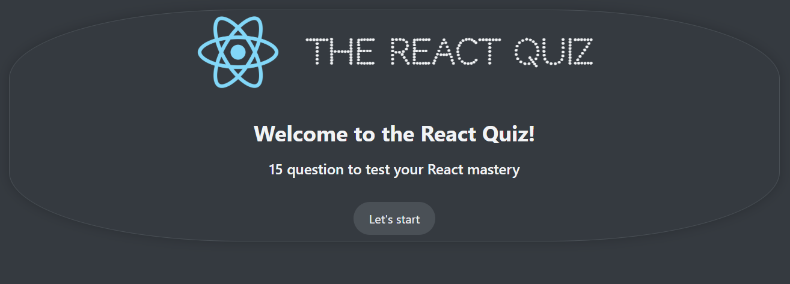
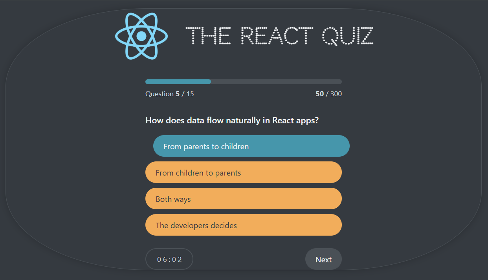
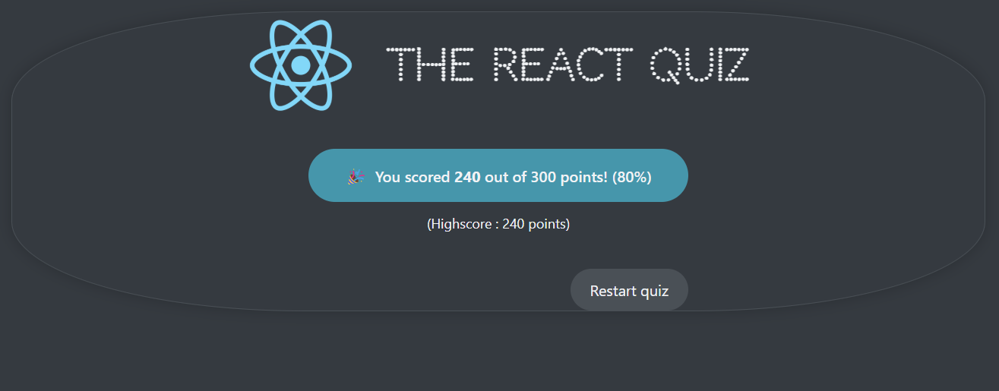

# Quiz-App With React

Quiz App is a web application built using JavaScript and React library. Users can see their scores by answering 15 questions retrieved from Json API.

## Introduction

The Quiz App application allows users to solve a 15-question react test.

To start the quiz, first install the node_modules files from the terminal with the npm install command.

Then, access the questions.json data in the data folder by running the npm run server command in the terminal.

The number of questions in the test and the start button are on the home page.

You can start the test with the start button, see your correct and incorrect answers, and when you finish the test, you can see the test result and your score on the screen. You can take the test again if you want.

The highest score you get in the test is recorded, and if you cannot pass this score in the next test, the highest score remains the same.

All the answers you give in the test are stored in the yourAnswers array in useReducer.

Good luck with the test :)

## Technologies Used

- HTML
- CSS
- JavaScript
- React
- UseReducer
- Context Api

## Features

- **Start Screen**:
  

- **Quiz Screen**:
  

- **Result Screen**:
  
